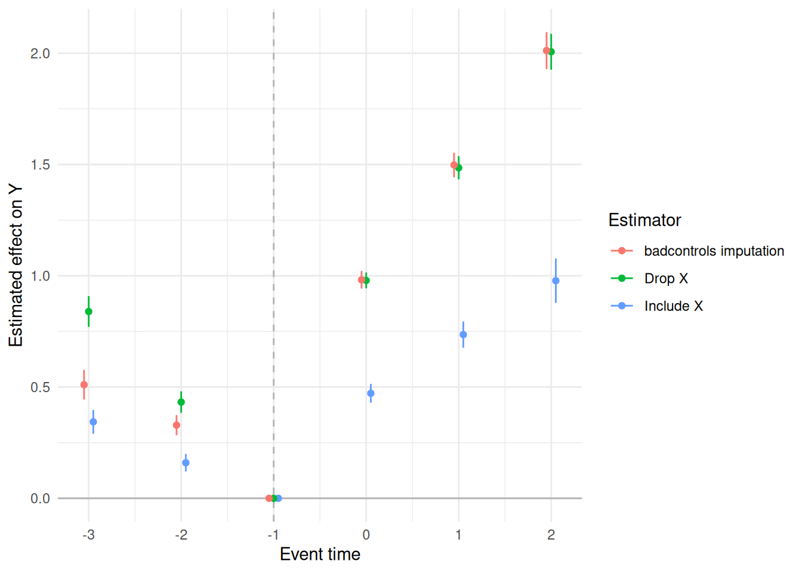

# Difference-in-Differences with Bad Controls: A Coding Example

This vignette shows the main workflow using simulated
staggered-treatment data. The data-generating process is the linear DGP
1 described in the paper. `X` is the time-varying bad control, `Y` is
the outcome, and `Z` and `W` are time-invariant covariates.

## Simulated data

``` r
library(badcontrols)
library(ggplot2)

set.seed(123)
sim <- simulate_bad_controls(
  n = 2000,
  T_max = 4,
  groups = 2:4,
  dgp = "dgp1",
  beta_drift = 0
)

head(sim$data)
#>   id period G D          Y          X          Z          W
#> 1  1      1 0 0 -0.7782891 -0.3266920 -0.5604756 -0.5381157
#> 2  1      2 0 0  0.6162895  0.3567673 -0.5604756 -0.5381157
#> 3  1      3 0 0  0.3039487  0.0787823 -0.5604756 -0.5381157
#> 4  1      4 0 0 -0.5515761 -0.3436366 -0.5604756 -0.5381157
#> 5  2      1 4 0  0.5169489  0.5687958 -0.2301775  0.2505197
#> 6  2      2 4 0  0.6478185  0.4791641 -0.2301775  0.2505197
```

In DGP 1, the untreated evolution of the bad control depends on its lag,
`W`, and `Z`. This determines the covariates used in the bad-control
event study below.

## Event study for the bad control

We first estimate an event study for `X` itself. Because `X` is the
outcome in this exercise, we set `d_outcome = FALSE`: the estimator
works with the level of `X` rather than a change in `X`. The
specification includes the lagged bad control, `W`, and `Z`, matching
the DGP 1 evolution equation.

``` r
x_event_study <- ptetools::pte_default(
  yname = "X",
  gname = "G",
  tname = "period",
  idname = "id",
  data = sim$data,
  xformula = ~X + W + Z,
  d_outcome = FALSE,
  d_covs_formula = ~-1,
  est_method = "reg",
  control_group = "notyettreated",
  base_period = "universal",
  bstrap = FALSE,
  cband = FALSE
)

bad_control_event_study <- data.frame(
  event_time = x_event_study$event_study$egt,
  estimate = x_event_study$event_study$att.egt,
  se = x_event_study$event_study$se.egt
)

bad_control_event_study
#>   event_time  estimate         se
#> 1         -3 0.1367879 0.01894161
#> 2         -2 0.1288322 0.01179028
#> 3         -1 0.0000000         NA
#> 4          0 0.4937464 0.01202674
#> 5          1 0.7399519 0.01862408
#> 6          2 0.9833666 0.02780254
```

## Three outcome estimators

We now estimate effects on `Y` in three ways:

1.  **Include the bad control:** use the observed post-treatment `X` as
    a covariate.
2.  **Drop the bad control:** use only `Z` as a covariate.
3.  **Use `badcontrols`:** recover the untreated version of `X` using
    `W` and `Z`, then use it in the outcome comparison.

The first two specifications use
[`ptetools::pte_default()`](https://rdrr.io/pkg/ptetools/man/pte_default.html).
The third uses
[`badcontrols::didbc()`](https://github.com/hugosantanna/badcontrols/reference/didbc.md)
with the imputation estimator. All three use the same
staggered-treatment setup and suppress the bootstrap so that the example
runs quickly.

``` r
pte_args <- list(
  yname = "Y",
  gname = "G",
  tname = "period",
  idname = "id",
  data = sim$data,
  est_method = "reg",
  control_group = "notyettreated",
  base_period = "universal",
  bstrap = FALSE,
  cband = FALSE
)

include_bad_control <- do.call(
  ptetools::pte_default,
  c(pte_args, list(
    xformula = ~Z + X,
    d_covs_formula = ~X,
    d_outcome = TRUE
  ))
)

drop_bad_control <- do.call(
  ptetools::pte_default,
  c(pte_args, list(
    xformula = ~Z,
    d_covs_formula = ~-1,
    d_outcome = TRUE
  ))
)

badcontrols_imputation <- didbc(
  yname = "Y",
  gname = "G",
  tname = "period",
  idname = "id",
  data = sim$data,
  bad_control_formula = ~X,
  bad_control_cov_formula = ~W,
  xformula = ~Z,
  est_method = "imputation",
  control_group = "notyettreated",
  base_period = "universal",
  bstrap = FALSE,
  cband = FALSE
)
```

The following plot compares the event-study estimates. Event time `-1`
is normalized to zero by the universal-base-period convention.

``` r
event_study_data <- function(result, estimator) {
  data.frame(
    event_time = result$event_study$egt,
    estimate = result$event_study$att.egt,
    se = result$event_study$se.egt,
    estimator = estimator
  )
}

outcome_event_studies <- rbind(
  event_study_data(include_bad_control, "Include X"),
  event_study_data(drop_bad_control, "Drop X"),
  event_study_data(badcontrols_imputation, "badcontrols imputation")
)

ggplot(outcome_event_studies, aes(event_time, estimate, colour = estimator)) +
  geom_hline(yintercept = 0, colour = "grey70") +
  geom_vline(xintercept = -1, linetype = "dashed", colour = "grey70") +
  geom_point(position = position_dodge(width = 0.15)) +
  geom_errorbar(
    aes(ymin = estimate - 1.96 * se, ymax = estimate + 1.96 * se),
    width = 0,
    position = position_dodge(width = 0.15),
    na.rm = TRUE
  ) +
  labs(
    x = "Event time",
    y = "Estimated effect on Y",
    colour = "Estimator"
  ) +
  theme_minimal()
```



The conceptual motivation for these comparisons is discussed in the
[conceptual
vignette](https://github.com/hugosantanna/badcontrols/articles/bad-controls-conceptual.md).
The package also provides parametric doubly robust and machine-learning
estimators for the covariate-unconfoundedness approach.
