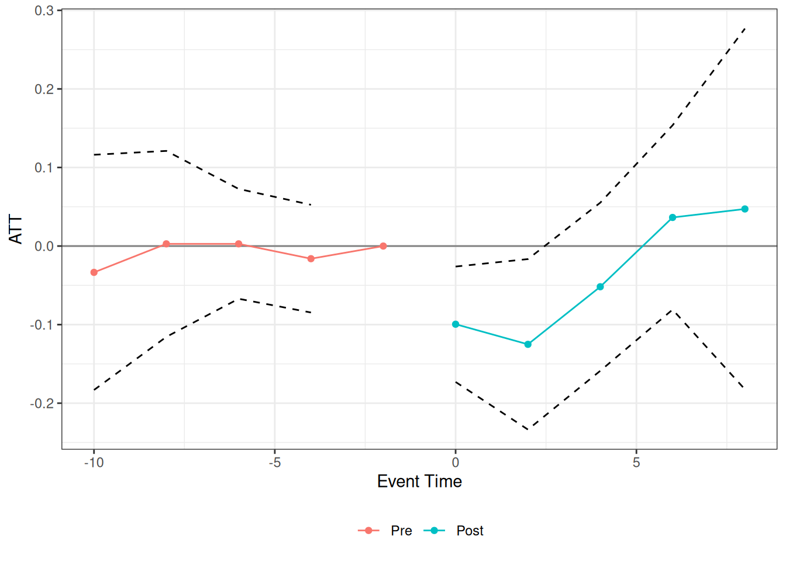

# Mini Application on Job Displacement

This vignette walks through the main `badcontrols` workflow using a
small scale version of the application in Caetano et al.
([2026](#ref-caetano-callaway-payne-santanna-2026)) that considers the
effect of job displacement on earnings treating a worker’s occupation
score as the bad control.

## NLSY data

`nlsy_job_displacement` is a balanced panel of NLSY79 respondents
observed biennially from 1992 to 2002. `log_earnings` is the outcome,
`occ_score` is the bad control (it can change when a respondent changes
occupation), and `group` gives each respondent’s displacement year (`0`
for never displaced).

``` r
library(badcontrols)
library(ptetools)

data(nlsy_job_displacement)
head(nlsy_job_displacement)
#>       id  year log_earnings occ_score group                   race female
#>    <int> <int>        <num>     <num> <int>                 <char> <lgcl>
#> 1:     8  1992     9.798127  2.040221     0 non_black_non_hispanic   TRUE
#> 2:     8  1994     9.928180  2.748872     0 non_black_non_hispanic   TRUE
#> 3:     8  1996    10.085809  2.748872     0 non_black_non_hispanic   TRUE
#> 4:     8  1998     9.998798  2.748872     0 non_black_non_hispanic   TRUE
#> 5:     8  2000    10.218298  2.748872     0 non_black_non_hispanic   TRUE
#> 6:     8  2002    10.357743  2.358675     0 non_black_non_hispanic   TRUE
#>    educ_max_grade
#>             <int>
#> 1:             14
#> 2:             14
#> 3:             14
#> 4:             14
#> 5:             14
#> 6:             14
table(nlsy_job_displacement$group[!duplicated(nlsy_job_displacement$id)])
#> 
#>    0 1994 1996 1998 2000 2002 
#> 2483  209  155  113  103  168
```

## Question 1: Is occupation score a bad control?

Before treating `occ_score` as a bad control, it’s worth checking
directly whether displacement actually affects it. We can do this with
the same group-time ATT machinery that
[`didbc()`](https://github.com/hugosantanna/badcontrols/reference/didbc.md)
builds on
([`ptetools::pte_default()`](https://rdrr.io/pkg/ptetools/man/pte_default.html)),
just using `occ_score` as the outcome instead of earnings.

``` r
occ_score_check <- pte_default(
  yname = "occ_score",
  gname = "group",
  tname = "year",
  idname = "id",
  data = nlsy_job_displacement,
  xformula = ~ race + female + educ_max_grade,
  d_outcome = FALSE,
  lagged_outcome_cov = TRUE,
  est_method = "reg",
  control_group = "notyettreated",
  base_period = "universal",
  bstrap = FALSE
)

summary(occ_score_check)
#> 
#> Overall ATT:  
#>     ATT    Std. Error     [ 95%  Conf. Int.]  
#>  -0.033        0.0113    -0.0553     -0.0108 *
#> 
#> 
#> Dynamic Effects:
#>  Event Time Estimate Std. Error [95% Simult.  Conf. Band]  
#>         -10  -0.0210     0.0228       -0.0791      0.0371  
#>          -8  -0.0218     0.0178       -0.0671      0.0235  
#>          -6   0.0015     0.0143       -0.0351      0.0380  
#>          -4  -0.0266     0.0125       -0.0584      0.0052  
#>          -2   0.0000         NA            NA          NA  
#>           0  -0.0398     0.0095       -0.0639     -0.0158 *
#>           2  -0.0290     0.0114       -0.0582      0.0002  
#>           4  -0.0070     0.0146       -0.0441      0.0301  
#>           6  -0.0198     0.0167       -0.0623      0.0228  
#>           8  -0.0138     0.0175       -0.0584      0.0308  
#> ---
#> Signif. codes: `*' confidence band does not cover 0
```

The results here indicate that job displacement reduces the occupation
score, especially in the period right after job displacement occurs.

## Estimating the effect of displacement on earnings

[`didbc()`](https://github.com/hugosantanna/badcontrols/reference/didbc.md)’s
main arguments mirror
[`did::att_gt()`](https://bcallaway11.github.io/did/reference/att_gt.html)/[`ptetools::pte_default()`](https://rdrr.io/pkg/ptetools/man/pte_default.html),
plus a few bad-control-specific ones: `bad_control_formula` (the bad
control itself, `occ_score`), `bad_control_cov_formula` (the
covariate(s) used to model its untreated evolution, `W`; here the
outcome itself, as in the paper’s application), and `xformula` (the
other covariates, `Z`).

Next, we provide estimates of the effect of job displacement on earnings
with occupation score treated as a bad control. We use the imputation
version of our estimator (`est_method = "imputation"`).

``` r
res_imputation <- didbc(
  yname = "log_earnings",
  gname = "group",
  tname = "year",
  idname = "id",
  data = nlsy_job_displacement,
  bad_control_formula = ~occ_score,
  bad_control_cov_formula = ~log_earnings,
  xformula = ~ race + female + educ_max_grade,
  est_method = "imputation",
  control_group = "notyettreated",
  base_period = "universal",
  bstrap = FALSE
)

summary(res_imputation)
#> 
#> Overall ATT:  
#>      ATT    Std. Error     [ 95%  Conf. Int.]  
#>  -0.0672        0.0188    -0.1042     -0.0303 *
#> 
#> 
#> Dynamic Effects:
#>  Event Time Estimate Std. Error [95% Simult.  Conf. Band]  
#>         -10  -0.0335     0.0517       -0.1832      0.1162  
#>          -8   0.0028     0.0409       -0.1156      0.1211  
#>          -6   0.0028     0.0241       -0.0671      0.0727  
#>          -4  -0.0161     0.0237       -0.0846      0.0525  
#>          -2   0.0000         NA            NA          NA  
#>           0  -0.0995     0.0254       -0.1730     -0.0261 *
#>           2  -0.1251     0.0375       -0.2336     -0.0166 *
#>           4  -0.0518     0.0369       -0.1588      0.0552  
#>           6   0.0364     0.0405       -0.0809      0.1537  
#>           8   0.0472     0.0793       -0.1824      0.2768  
#> ---
#> Signif. codes: `*' confidence band does not cover 0
```

[`didbc()`](https://github.com/hugosantanna/badcontrols/reference/didbc.md)
returns event studies alongside the overall ATT, which are plotted
below.

``` r
plot(res_imputation)
```



### Other estimators

The same call works for the doubly robust and machine-learning
estimators (`est_method = "dr_ml"`). Only the relevant arguments change:

``` r
# Doubly robust, parametric (OLS/logit) nuisance functions
didbc(
  yname = "log_earnings",
  gname = "group",
  tname = "year",
  idname = "id",
  data = nlsy_job_displacement,
  bad_control_formula = ~occ_score,
  bad_control_cov_formula = ~log_earnings,
  xformula = ~ race + female + educ_max_grade,
  est_method = "dr_ml",
  nuisance_method = "parametric",
  control_group = "notyettreated",
  base_period = "universal",
  bstrap = FALSE
)

# Doubly robust, cross-fitted machine-learning (grf) nuisance functions
didbc(
  yname = "log_earnings",
  gname = "group",
  tname = "year",
  idname = "id",
  data = nlsy_job_displacement,
  bad_control_formula = ~occ_score,
  bad_control_cov_formula = ~log_earnings,
  xformula = ~ race + female + educ_max_grade,
  est_method = "dr_ml",
  nuisance_method = "ml",
  control_group = "notyettreated",
  base_period = "universal",
  bstrap = FALSE
)
```

Finally, instead of covariate unconfoundedness,
[`didbc()`](https://github.com/hugosantanna/badcontrols/reference/didbc.md)
also supports assuming *parallel trends for the bad control itself*
(`bad_control_identification_strategy = "did"`). Since this approach
requires an additional linearity condition, it is only available for
`est_method = "imputation"`, and still uses `bad_control_cov_formula`
(`W`) if supplied:

``` r
didbc(
  yname = "log_earnings",
  gname = "group",
  tname = "year",
  idname = "id",
  data = nlsy_job_displacement,
  bad_control_formula = ~occ_score,
  bad_control_cov_formula = ~log_earnings,
  xformula = ~ race + female + educ_max_grade,
  est_method = "imputation",
  bad_control_identification_strategy = "did",
  control_group = "notyettreated",
  base_period = "universal",
  bstrap = FALSE
)
```

Caetano, Carolina, Brantly Callaway, Stroud Payne, and Hugo Sant’Anna.
2026. “Difference-in-Differences with Bad Controls.” *arXiv Preprint
arXiv:2608.03881*. <https://arxiv.org/abs/2608.03881>.
