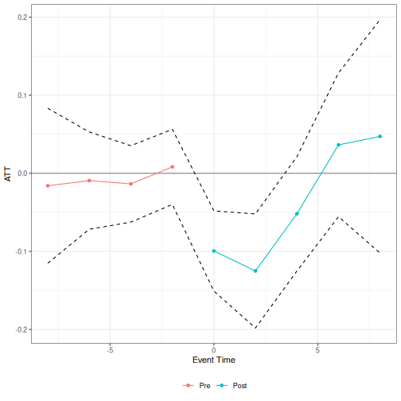

<!--
This file is the live, re-executable SOURCE for bad-controls-coding.qmd.
It is precompiled (not built live) because R CMD build installs the
package into a temporary library that the quarto CLI subprocess can't
reliably see -- a known upstream limitation of the quarto R package's
vignette engine, confirmed to break on Windows CI (see dev/NOTES.md).
Regenerate the shipped vignettes/bad-controls-coding.qmd with:
  Rscript vignettes/precompile.R
after any edit to this file.
-->

This vignette walks through the main `badcontrols` workflow using a small scale version of the application in @caetano-callaway-payne-santanna-2026 that considers the effect of job displacement on earnings treating a worker's occupation score as the bad control.

## NLSY data

`nlsy_job_displacement` is a balanced panel of NLSY79 respondents observed
biennially from 1992 to 2002. `log_earnings` is the outcome, `occ_score` is
the bad control (it can change when a respondent changes occupation), and
`group` gives each respondent's displacement year (`0` for never
displaced).


``` r
library(badcontrols)
library(ptetools)

data(nlsy_job_displacement)
head(nlsy_job_displacement)
#>       id  year log_earnings occ_score group                   race female
#>    <int> <int>        <num>     <num> <int>                 <char> <lgcl>
#> 1:     8  1992     9.798127  2.040221     0 non_black_non_hispanic   TRUE
#> 2:     8  1994     9.928180  2.748872     0 non_black_non_hispanic   TRUE
#> 3:     8  1996    10.085809  2.748872     0 non_black_non_hispanic   TRUE
#> 4:     8  1998     9.998798  2.748872     0 non_black_non_hispanic   TRUE
#> 5:     8  2000    10.218298  2.748872     0 non_black_non_hispanic   TRUE
#> 6:     8  2002    10.357743  2.358675     0 non_black_non_hispanic   TRUE
#>    educ_max_grade
#>             <int>
#> 1:             14
#> 2:             14
#> 3:             14
#> 4:             14
#> 5:             14
#> 6:             14
table(nlsy_job_displacement$group[!duplicated(nlsy_job_displacement$id)])
#> 
#>    0 1994 1996 1998 2000 2002 
#> 2483  209  155  113  103  168
```

## Question 1: Is occupation score a bad control?

Before treating `occ_score` as a bad control, it's worth checking directly
whether displacement actually affects it. We can do this with the same
group-time ATT machinery that `didbc()` builds on
(`ptetools::pte_default()`), just using `occ_score` as the outcome instead
of earnings.


``` r
occ_score_check <- pte_default(
  yname = "occ_score",
  gname = "group",
  tname = "year",
  idname = "id",
  data = nlsy_job_displacement,
  xformula = ~ race + female + educ_max_grade,
  d_outcome = FALSE,
  lagged_outcome_cov = TRUE,
  est_method = "reg",
  control_group = "notyettreated",
  base_period = "universal",
  bstrap = FALSE
)

summary(occ_score_check)
#> 
#> Overall ATT:  
#>     ATT    Std. Error     [ 95%  Conf. Int.]  
#>  -0.033        0.0093    -0.0512     -0.0148 *
#> 
#> 
#> Dynamic Effects:
#>  Event Time Estimate Std. Error [95% Pointwise  Conf. Band]  
#>         -10  -0.0210     0.0218         -0.0638      0.0218  
#>          -8  -0.0218     0.0169         -0.0549      0.0114  
#>          -6   0.0015     0.0146         -0.0272      0.0301  
#>          -4  -0.0266     0.0127         -0.0514     -0.0018 *
#>          -2   0.0000         NA              NA          NA  
#>           0  -0.0398     0.0109         -0.0612     -0.0185 *
#>           2  -0.0290     0.0119         -0.0523     -0.0057 *
#>           4  -0.0070     0.0147         -0.0358      0.0218  
#>           6  -0.0198     0.0167         -0.0525      0.0129  
#>           8  -0.0138     0.0201         -0.0533      0.0257  
#> ---
#> Signif. codes: `*' confidence band does not cover 0
```

The results here indicate that job displacement reduces the occupation score, especially in the period right after job displacement occurs.

## Estimating the effect of displacement on earnings

`didbc()`'s main arguments mirror `did::att_gt()`/`ptetools::pte_default()`,
plus a few bad-control-specific ones: `bad_control_formula` (the bad
control itself, `occ_score`), `bad_control_cov_formula` (the covariate(s)
used to model its untreated evolution, `W`; here the outcome itself, as in
the paper's application), and `xformula` (the other covariates, `Z`).

Next, we provide estimates of the effect of job displacement on earnings with occupation score treated as a bad control.  We use the imputation version of our estimator (`est_method = "imputation"`).


``` r
res_imputation <- didbc(
  yname = "log_earnings",
  gname = "group",
  tname = "year",
  idname = "id",
  data = nlsy_job_displacement,
  bad_control_formula = ~occ_score,
  bad_control_cov_formula = ~log_earnings,
  xformula = ~ race + female + educ_max_grade,
  est_method = "imputation",
  control_group = "notyettreated",
  base_period = "universal",
  bstrap = FALSE
)

summary(res_imputation)
#> 
#> Overall ATT:  
#>      ATT    Std. Error     [ 95%  Conf. Int.]  
#>  -0.0672        0.0242    -0.1146     -0.0199 *
#> 
#> 
#> Dynamic Effects:
#>  Event Time Estimate Std. Error [95% Pointwise  Conf. Band]  
#>         -10  -0.0335     0.0561         -0.1434      0.0764  
#>          -8   0.0028     0.0360         -0.0679      0.0734  
#>          -6   0.0028     0.0256         -0.0474      0.0530  
#>          -4  -0.0161     0.0247         -0.0645      0.0323  
#>          -2   0.0000         NA              NA          NA  
#>           0  -0.0995     0.0262         -0.1509     -0.0482 *
#>           2  -0.1251     0.0373         -0.1982     -0.0521 *
#>           4  -0.0518     0.0374         -0.1251      0.0214  
#>           6   0.0364     0.0470         -0.0556      0.1285  
#>           8   0.0472     0.0762         -0.1022      0.1966  
#> ---
#> Signif. codes: `*' confidence band does not cover 0
```

`didbc()` returns event studies alongside the overall ATT, which are plotted below.


``` r
plot(res_imputation)
```



### Other estimators

The same call works for the doubly robust and machine-learning estimators
(`est_method = "dr_ml"`). Only the relevant arguments change:


``` r
# Doubly robust, parametric (OLS/logit) nuisance functions
didbc(
  yname = "log_earnings",
  gname = "group",
  tname = "year",
  idname = "id",
  data = nlsy_job_displacement,
  bad_control_formula = ~occ_score,
  bad_control_cov_formula = ~log_earnings,
  xformula = ~ race + female + educ_max_grade,
  est_method = "dr_ml",
  nuisance_method = "parametric",
  control_group = "notyettreated",
  base_period = "universal",
  bstrap = FALSE
)

# Doubly robust, cross-fitted machine-learning (grf) nuisance functions
didbc(
  yname = "log_earnings",
  gname = "group",
  tname = "year",
  idname = "id",
  data = nlsy_job_displacement,
  bad_control_formula = ~occ_score,
  bad_control_cov_formula = ~log_earnings,
  xformula = ~ race + female + educ_max_grade,
  est_method = "dr_ml",
  nuisance_method = "ml",
  control_group = "notyettreated",
  base_period = "universal",
  bstrap = FALSE
)
```

Finally, instead of covariate unconfoundedness, `didbc()` also supports assuming
*parallel trends for the bad control itself*
(`bad_control_identification_strategy = "did"`).  Since this approach requires an additional linearity condition, it is only available for `est_method = "imputation"`, and still uses
`bad_control_cov_formula` (`W`) if supplied:


``` r
didbc(
  yname = "log_earnings",
  gname = "group",
  tname = "year",
  idname = "id",
  data = nlsy_job_displacement,
  bad_control_formula = ~occ_score,
  bad_control_cov_formula = ~log_earnings,
  xformula = ~ race + female + educ_max_grade,
  est_method = "imputation",
  bad_control_identification_strategy = "did",
  control_group = "notyettreated",
  base_period = "universal",
  bstrap = FALSE
)
```


